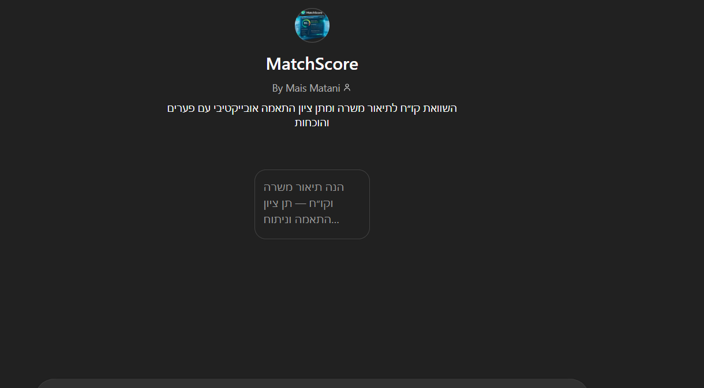

# MatchScore — AI Agent for CV ↔ Job Description Matching

MatchScore is an AI agent that compares a candidate’s CV with a Job Description and produces:
- **Match Score (0–100)**
- **Strengths & gaps**
- **Actionable recommendations** for improving fit

## Demo
- 🎥 Video demo (Google Drive): https://drive.google.com/file/d/1lQfXs_NPcM24vrzjNgJuI0ELSf5v9kkt/view?usp=drive_link
- 🤖 Agent link (ChatGPT): https://chatgpt.com/g/g-6973b0c982ec8191a540f05cd1d20737-matchscore

## What it does
1. Extracts structured requirements from the Job Description (skills, experience, tools, must-haves).
2. Parses the CV into a structured profile (skills, roles, achievements, tools).
3. Compares both sides and assigns a **transparent score**.
4. Returns:
   - Matching highlights
   - Missing requirements
   - Suggestions to close gaps

## Key Features
- ✅ **Structured scoring** (consistent evaluation)
- ✅ **Gap analysis** (what’s missing + why it matters)
- ✅ **Explainability** (clear reasoning + evidence-based output where applicable)
- ✅ **Responsible AI** considerations (privacy + bias awareness)

## Tech & Approach
- Prompt engineering for structured extraction + evaluation
- Step-by-step decomposition (requirements → profile → scoring → recommendations)
- Output formatting for recruiter-friendly summaries

## Repository Structure (recommended)
- `README.md` — project overview (this file)
- `assets/` — screenshots / GIFs
- `docs/` — presentation / writeups
- `examples/` — anonymized sample inputs & outputs

## Privacy Notice
Do **not** upload real CVs with personal details.  
Use anonymized examples (remove phone, email, addresses, IDs).

## License
Choose one if you want (e.g., MIT). If this is a course project, you can also keep it “All rights reserved”.

